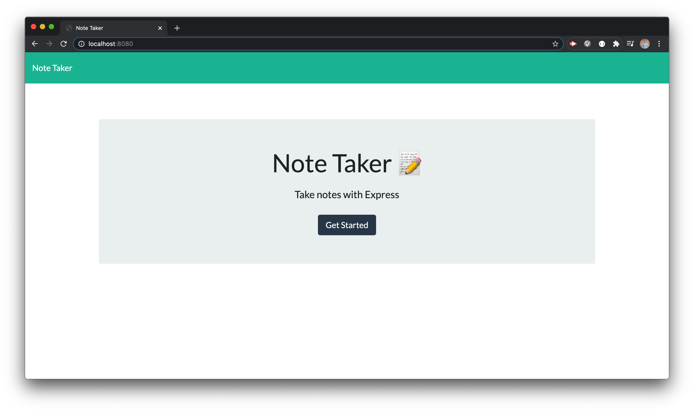

# Express Note Taker

## Description
<!-- This repository holds the homework assignment for Week 11 of the [The Coding Boot Camp](https://techbootcamps.utexas.edu/coding/) through the University of Texas at Austin's Center for Professional Education. -->

This is an application that uses the Express.js framework to create a server-side API. This application uses GET and POST requests to view and submit information to the server when the various endpoints are visited. This application allows a user to write notes, view submitted notes, and delete notes. 

This application uses the [express](https://www.npmjs.com/package/express), [fs](https://nodejs.org/api/fs.html), [path](https://nodejs.org/api/path.html), and [uuid](https://www.npmjs.com/package/uuid) modules to handle the needed processes.

## Notes
* To clean up code I separated my routing from the starter js file (```server.js```). This was done by creating a ```routes``` folder, exporting the GET and POST requests as functions and then importing those functions into the starter js file (```server.js```).
    > 
    > 
    > 
    > 

## Instructions
This project can be opened and run in multiple ways.
* If you would like to run this application locally, clone this [repository](https://github.com/ryanrotman/express-note-taker) and then open it in your text editor of choice. You will also need access to a CLI. This project was created using VSCode and then run in the integrated terminal. Assuming that Node.js is already installed, you will need to run ```npm install```, then ```npm run start```, and then navigate to ```localhost:8080``` to launch the application.
* You can also use this application that is hosted on [Heroku](https://rr-express-note-taker.herokuapp.com/).

## Page Screenshots
Home Page

Notes Page

Console Logs from VS Code integrated terminal showing notes being successfully saved and deleted


## Contributing
Any and all collaboration is welcome so if you have any suggestions or thoughts for new features, please send me an email at ryan.rotman@gmail.com.